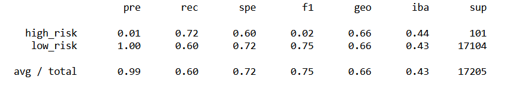
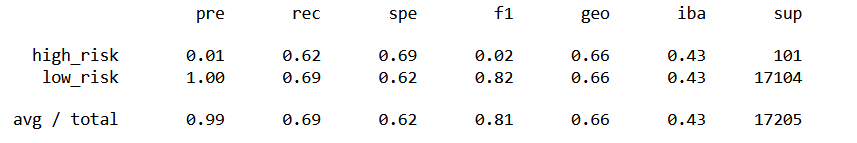
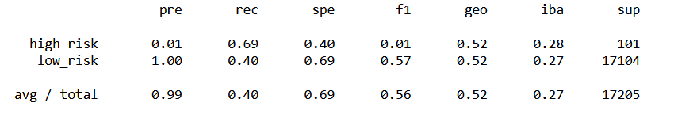
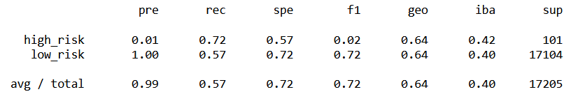
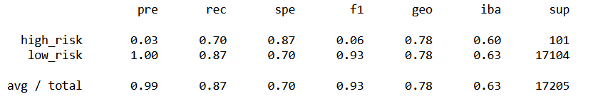
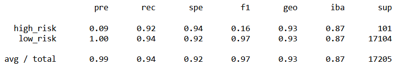

# Credit Risk Analysis

## Overview of Analysis

The aim of this analysis is to compare the performance of six different approaches to predicting credit risk. Using a credit card data set from LendingClub, a peer-to-peer lending services company, we test the performance of two oversampling methods (RandomOverSampler and SMOTE), one undersampling method (ClusterCentroids), one over- and undersampling method (SMOTEENN), and two machine learning models (BalancedRandomForestClassifier and EasyEnemsbleClassifier). The final goal is to make a recommendation as to which model is the most effective at predicting credit card risk, if there is one.

The results presented for each model will include the balanced accuracy score and the classification report for the model's predictions. Since the goal of this exercise is to accurately pin point instances of high risk loans, we will put more emphasis on the precision score of these models. In this case, it is important to be sure that if a loan is marked as high risk, that it truly is high risk, as we do not want to erroneously block a loan candidate from taking out their requested loan. An oversensitive model may be successful in predicting high risk loans, but may also tag low risk loans as risky, impeding a low risk candidate from taking out a loan and reducing LendingClub's profit margin.

## Results

### Oversampling: RandomOverSampler

Balanced Accuracy Score: 0.661

Classification Report:

Based on the precision rates, this test has a high success rate (100%) of predicting low risk loans, but has an almost insignificant success rate when it come to precisely predicting high risk loans. Since the intention of this exercise is to predict instances of high risk loans, this model does not appear to be very helpful.

The sensitivity rates for this model seem relatively high, but as discussed in the overview of our analysis, a high sensitivity rate may actually be detrimental in this scenario, causing low risk loans to be classified as high risk.

### Oversampling: SMOTE

Balanced Accuracy Score: 0.658

Classification Report:

The accuracy score for this model is slightly higher than the previous oversampling model. However, the precision for high risk loan prediction has not improved, making this model equally ineffective as the previous model. In this case, the sensitivity of the model has also decreased for high risk loans.

### Undersampling: ClusterCentroids

Balanced Accuracy Score: 0.545

Classification Report:

The accuracy score for the undersampling model is lower than that of the two oversampling models. The precision of predicting high risk loans has not improved. Consequently, this model does not have any improved metrics over the two oversampling models.

### Combination Sampling: SMOTEENN

Balanced Accuracy Score: 0.645

Classification Report:

The combination sampling model has similar results to the two oversampling models both regarding its balanced accuracy score and its precision score for predicting high risk loans. It does not fare significantly worse, but also does not seem to present any advantages to the two oversampling models.

### BalancedRandomForestClassifier

Balanced Accuracy Score: 0.789

Classification Report:

The BalancedRandomForestClassifier machine learniing model has a significantly higher accuracy score than any of the other models. It also has a higher precision score for predicting high risk loans, although it still only has a precision rate of 3%. Its sensitivity score is also higher than any of the previous models. This model seems to have measurable advantages over the previous models tested.

### Easy Ensemble AdaBoost Classifier

Balanced Accuracy Score: 0.931

Classification Report:

This machine learning model has by far the highest balanced accuracy score of all the models tested, at 93%. It also has the highest precision score for predicting high risk loans, at 9%, as well as the highest sensitivity scores. When comparing all of the models tested, this model has significant advantages over all of the previous models, including the BalancedRandomForestClassifier model.

## Summary

When comparing all six models tested, the Easy Ensemble AdaBoost Classifier has measurable advantages over the other five models. It performed better on all measures, including the balanced accuracy score, the precision scores, and the sensitivity scores. However, its precision score is still only at 9%, meaning that of all the loans tagged as being high risk, only 9% are actually high risk. However, the high sensitivity score implies that out of all the loans that are high risk, 94% of them will be accurately labeled as high risk. 

Ideally, we would like to create a model with a much higher precision rate for high risk loans. This may require a larger dataset to train a more precise model. In tha absence of a better model, a solution to mitigating the low precision of this model may simply be to bring include human analysis after high risk loans have been identified by the model to continue to weed out loans that are in fact low risk. 
